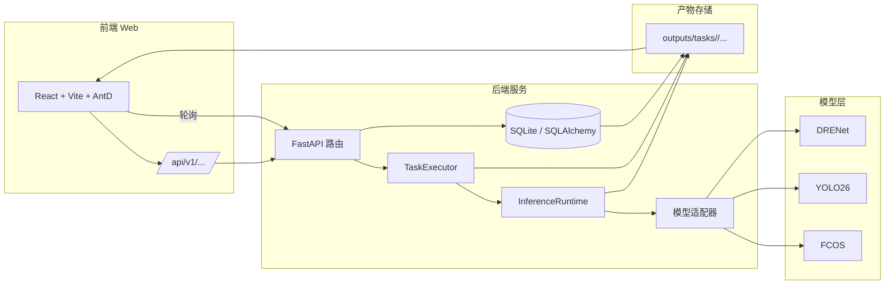

# 系统分层架构说明

## 1. 核心目标映射
系统目标：**输入一张图像 -> 三模型推理 -> 融合后输出一个最终结果（ensemble）**。

对应实现链路：
1. `tools/run_predict.py` / `tools/visualize_predict.py` / `tools/desktop_ui_qt.py` 接收输入。
2. `src/application/predict_service.py` 调度 `drenet`、`mmdet_fcos`、`yolo` 三个 Adapter。
3. `src/application/fusion.py` 对多模型结果做 IoU 聚类 + 加权融合。
4. 输出统一结构（bbox/score/category_id）并可视化或落盘。

## 2. 分层与职责边界
| 层 | 目录/文件 | 可依赖对象 | 禁止事项 |
|---|---|---|---|
| Presentation | `tools/*.py` | `application`、`infrastructure.visualization` | 不得直接写模型加载与推理逻辑 |
| Application | `src/application/*` | `domain`、`infrastructure` 抽象能力 | 不得依赖具体 UI 框架 |
| Domain | `src/domain/*` | Python 标准库 | 不得依赖 PyTorch/MMDet/Ultralytics |
| Infrastructure | `src/infrastructure/*` | 第三方框架、IO、配置读取 | 不得承载业务编排（由 application 负责） |
| Compatibility | `src/core/*`、`src/adapters/*` | 新分层实现（re-export） | 不得新增业务逻辑 |

## 3. 数据流文字版（与 `architecture.mmd` 对应）
1. 输入层：路径、模型名、阈值参数进入 Presentation。
2. 编排层：`PredictService` 完成参数校验、模型选择、异常收敛。
3. 推理层：三个 Adapter 分别执行框架推理并输出统一 bbox 结构。
4. 融合层：`fuse_predictions` 进行聚类与加权框融合。
5. 输出层：返回 JSON，必要时渲染可视化图片。

## 6. 系统流程与 Web 架构示意

### 6.1 全链路流程图（Mermaid）
```mermaid
flowchart TD
  A[用户进入 Web 控制台] --> B[选择任务类型/推理模式/阈值]
  B --> C[上传影像]
  C --> D[前端调用 /api/v1/tasks/infer]
  D --> E[后端创建任务 + 入库]
  E --> F[TaskExecutor 调度推理]
  F --> G[InferenceRuntime 调用模型适配器]
  G --> H[DRENet / YOLO / FCOS 推理]
  H --> I[生成 per_model / fused 结果]
  I --> J[可视化渲染输出图]
  J --> K[写入 outputs/tasks/<id> + DB]
  K --> L[前端轮询 /tasks/{id} 与 /tasks/{id}/results]
  L --> M[展示状态 + 图像 + 表格]
```

### 6.2 Web 架构图（Mermaid）


## 4. 关键设计决策
- 默认系统模式：`ensemble`（三模型综合）。
- 单模型模式保留，用于调试与消融。
- 兼容层保留旧导入路径，保证历史代码可运行。

## 5. 扩展规则
1. 新增模型：在 `src/infrastructure/adapters/` 新增 Adapter，并在 `adapter_factory.py` 注册。
2. 新增融合策略：在 `src/application/fusion.py` 增加函数并在 `predict_service.py` 调用。
3. 新增 UI：只新增 `tools/` 入口，不改 domain。
