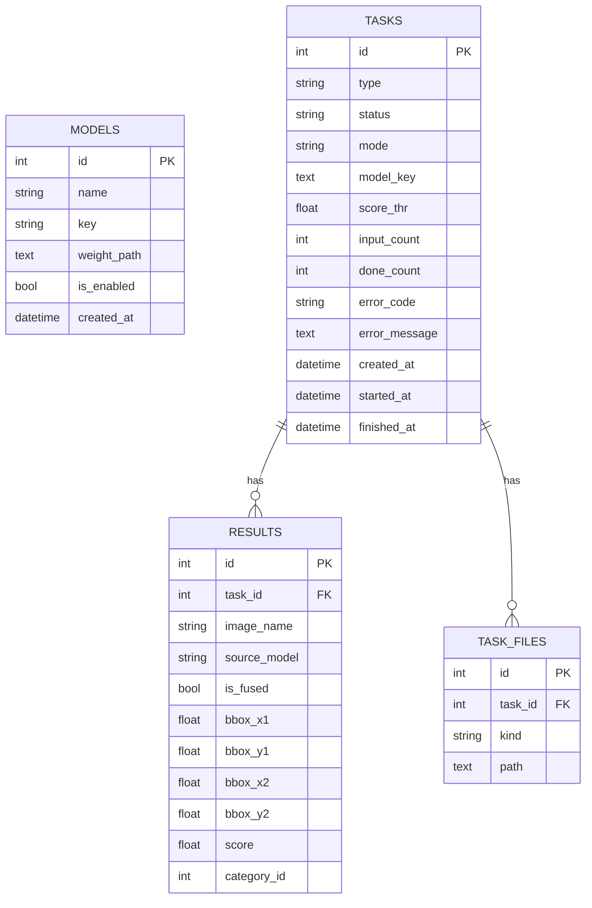

# 数据库ER图

```mermaid
erDiagram
    MODELS {
        int id PK
        string name
        string key
        text weight_path
        bool is_enabled
        datetime created_at
    }

    TASKS {
        int id PK
        string type
        string status
        string mode
        text model_key
        float score_thr
        int input_count
        int done_count
        string error_code
        text error_message
        datetime created_at
        datetime started_at
        datetime finished_at
    }

    RESULTS {
        int id PK
        int task_id FK
        string image_name
        string source_model
        bool is_fused
        float bbox_x1
        float bbox_y1
        float bbox_x2
        float bbox_y2
        float score
        int category_id
    }

    TASK_FILES {
        int id PK
        int task_id FK
        string kind
        text path
    }

    TASKS ||--o{ RESULTS : has
    TASKS ||--o{ TASK_FILES : has
```
