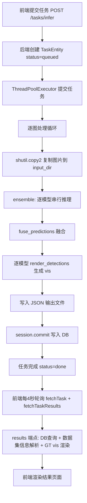

# 系统响应速度优化方案

## 问题概述

模型推理本身速度较快，但用户在可视化界面上感知到的任务完成速度明显慢于模型实际推理速度。
根因：**推理之外的串行开销**累积导致端到端延迟远大于纯推理耗时。

---

## 数据流路径分析



---

## 瓶颈识别与优化方案

### 瓶颈 1 — ensemble 模式下模型串行推理 🔴 最高优先级

**位置**: [`InferenceRuntime.predict_ensemble()`](backend/app/services/inference_runtime.py:32)

**问题**: 3 个模型逐个推理，总耗时 = model1_time + model2_time + model3_time。
假设每个模型推理 200ms，串行总耗时 600ms，而并行仅需 ~200ms。

**当前代码**:

```python
def predict_ensemble(self, image_path, model_keys, score_thr):
    per_model = []
    for model_key in model_keys:  # 串行遍历！
        per_model.extend(self.predict_single(...))
    fused = fuse_predictions(records=per_model, ...)
    return per_model, fused
```

**优化方案**: 使用 `concurrent.futures.ThreadPoolExecutor` 并行推理所有模型，然后汇总结果做融合。

```python
def predict_ensemble(self, image_path, model_keys, score_thr):
    with ThreadPoolExecutor(max_workers=len(model_keys)) as pool:
        futures = {
            pool.submit(self.predict_single, image_path, key, score_thr): key
            for key in model_keys
        }
        per_model = []
        for future in as_completed(futures):
            per_model.extend(future.result())
    fused = fuse_predictions(records=per_model, ...)
    return per_model, fused
```

**注意事项**: 多模型共享 GPU 时需关注显存竞争；若显存不足可设 `max_workers=2` 降级并行度。
CPU 侧的前后处理（图像解码、后处理解析）完全可以并行。

**预期收益**: ensemble 推理阶段耗时从 **sum** 降为 **max**，3 模型场景约 **3x 提速**。

---

### 瓶颈 2 — 前端轮询策略低效 🔴 最高优先级

**位置**: [`TaskDetailPage.tsx`](frontend/src/pages/TaskDetailPage.tsx:228)

**问题**:

1. 轮询间隔 4 秒，任务完成后最多需等 4 秒才能看到结果
2. 每次轮询同时调用 `fetchTask` + `fetchTaskResults`，而 `fetchTaskResults` 是重量级端点
3. 任务 running 期间反复拉取完整结果数据，大部分是无效请求

**当前代码**:

```tsx
useEffect(() => {
  if (!task || (task.status !== 'queued' && task.status !== 'running')) return
  const timer = setInterval(load, 4000) // 4秒轮询，每次都拉全量结果
  return () => clearInterval(timer)
}, [taskId, task?.status])
```

**优化方案**: 分离轻量状态轮询与重量结果获取。

1. **新增轻量进度端点** `GET /api/v1/tasks/{id}/progress`，仅返回 `{status, done_count, input_count}`
2. **前端策略**:
   - running 期间：每 1.5 秒轮询 progress 端点（轻量），更新进度条
   - status 变为 done/failed 时：一次性拉取 `fetchTaskResults`（重量），渲染完整结果
   - 取消 running 期间对 results 端点的重复调用

**预期收益**:

- 任务完成后的感知延迟从 **4s** 降为 **1.5s**
- running 期间网络流量减少 **~80%**（不再反复拉全量结果）
- 进度条更新更流畅

---

### 瓶颈 3 — 可视化渲染重复开图 + 多次渲染 🟡 中优先级

**位置**: [`TaskExecutor._run_task()`](backend/app/services/task_executor.py:107-116)

**问题**: ensemble 模式下，对同一张图调用 `render_detections` 4 次（3 个模型 + 1 个融合），
每次都重新 `Image.open(src)` 打开原图。大尺寸遥感图（如 16384×17285）解码耗时显著。

**当前代码**:

```python
for model_name, rows in self._group_predictions_by_model(per_model).items():
    render_detections(str(local_input), rows, str(vis_path))  # 每次重新打开原图
render_detections(str(local_input), fused, str(fused_vis_path))  # 又打开一次
```

**优化方案**:

方案 A — **复用 Image 对象**：修改 `render_detections` 接受 `PIL.Image` 对象而非路径，在 `_run_task` 中只打开一次原图。

```python
src_image = Image.open(str(local_input)).convert('RGB')
for model_name, rows in ...:
    render_detections(src_image, rows, str(vis_path))  # 传入已打开的 Image
render_detections(src_image, fused, str(fused_vis_path))
```

方案 B — **延迟渲染**：任务执行时只保存推理结果 JSON，vis 图片在用户请求 results 时按需渲染并缓存。
此方案更激进，可彻底消除任务执行阶段的渲染开销，但需要改造 results 端点。

**推荐**: 先实施方案 A（改动小、收益明确），后续可考虑方案 B。

**预期收益**: ensemble 模式下图片解码从 **4 次** 降为 **1 次**，大图场景节省 **数百 ms**。

---

### 瓶颈 4 — DB 频繁 commit 🟡 中优先级

**位置**: [`TaskExecutor._run_task()`](backend/app/services/task_executor.py:102-138)

**问题**: 每处理完一张图就 `session.commit()`，包含多次 `session.add` + 一次 commit。
对于 batch 任务（如 10 张图），产生 10 次 commit，每次都有磁盘 I/O。

**优化方案**:

- 在循环内只做 `session.add`（缓存到 session），不逐图 commit
- 改为每 N 张图批量 commit 一次，或循环结束后一次性 commit
- 保留 `task.done_count` 的中间更新用于进度查询，但可以每 2-3 张图更新一次

**预期收益**: batch 任务 DB 写入耗时减少 **50-70%**。

---

### 瓶颈 5 — results 端点重复计算 🟡 中优先级

**位置**: [`routes.py get_task_results()`](backend/app/api/routes.py:330-420)

**问题**: 每次调用 results 端点都执行：

1. `_resolve_dataset_info()` — 遍历 train/val/test 目录查找图片
2. `_load_reference_boxes_from_info()` — 读取 label 文件解析参考框
3. `_ensure_gt_vis()` — 可能实时渲染 GT 可视化图

这些计算结果对同一张图片是不变的，但每次请求都重新计算。

**优化方案**:

- 在 `_run_task` 阶段预计算 dataset info 和 reference boxes，存入 DB 或 JSON
- results 端点直接读取预计算结果，不再做目录遍历和文件解析
- GT vis 已有文件缓存逻辑（`out_path.exists()` 检查），但首次仍需渲染，可移到任务执行阶段

**预期收益**: results 端点响应时间减少 **30-50%**，尤其对数据集内图片。

---

### 瓶颈 6 — 图片文件复制开销 🟢 低优先级

**位置**: [`TaskExecutor._run_task()`](backend/app/services/task_executor.py:92-93)

**问题**: `shutil.copy2` 将原图复制到 task input_dir，大图（数 MB）复制耗时。

**优化方案**: 使用 `os.symlink` 创建符号链接代替文件复制（仅当源文件在同一文件系统时）。

**预期收益**: 小优化，大图场景节省 **数十 ms**。

---

### 瓶颈 7 — 模型首次加载延迟 🟢 低优先级

**位置**: [`BaseAdapter.ensure_loaded()`](src/infrastructure/adapters/base.py:18-21)

**问题**: 首次推理触发 `load_model()`，加载权重到内存/显存，耗时数秒。
后续推理复用已加载模型，但第一个任务的感知速度受影响。

**优化方案**: 在 `create_app()` 阶段预加载所有已启用模型，避免首次推理的加载延迟。

**预期收益**: 首次任务提交后的等待感消除，但增加应用启动时间。

---

## 优化实施优先级排序

| 序号 | 瓶颈                         | 优先级 | 预期收益               | 改动范围                            |
| ---- | ---------------------------- | ------ | ---------------------- | ----------------------------------- |
| 1    | ensemble 串行推理 → 并行推理 | 🔴 高  | 3x 推理提速            | inference_runtime.py                |
| 2    | 前端轮询策略优化             | 🔴 高  | 感知延迟 4s→1.5s       | routes.py + TaskDetailPage.tsx      |
| 3    | 可视化复用 Image 对象        | 🟡 中  | 大图解码 4x→1x         | visualization.py + task_executor.py |
| 4    | DB 批量 commit               | 🟡 中  | batch 任务 DB 提速 50% | task_executor.py                    |
| 5    | results 端点缓存             | 🟡 中  | 端点响应提速 30%       | routes.py + task_executor.py        |
| 6    | symlink 替代 copy            | 🟢 低  | 小优化                 | task_executor.py                    |
| 7    | 模型预加载                   | 🟢 低  | 首次任务提速           | main.py + inference_runtime.py      |

---

## 实施计划

### Phase 1 — 核心提速（瓶颈 1 + 2）

1. **改造 `InferenceRuntime.predict_ensemble` 为并行推理**
   - 引入 `concurrent.futures.ThreadPoolExecutor`
   - 添加 `max_parallel_models` 配置项控制并行度
   - 保留串行 fallback 用于显存不足场景

2. **新增轻量进度端点 + 前端轮询策略重构**
   - 后端新增 `GET /api/v1/tasks/{id}/progress` 端点
   - 前端 `TaskDetailPage` 分离状态轮询与结果获取
   - running 时只轮询 progress，done 时一次性拉 results

### Phase 2 — I/O 与渲染优化（瓶颈 3 + 4 + 5）

3. **`render_detections` 支持 PIL.Image 输入**
   - 修改函数签名，接受 `image_path | PIL.Image`
   - `task_executor` 中只打开一次原图，复用传入

4. **DB 批量写入优化**
   - 循环内 `session.add` 不立即 commit
   - 每 N 张图或循环结束统一 commit

5. **results 端点预计算缓存**
   - 任务执行阶段预存 dataset info
   - results 端点直接读缓存

### Phase 3 — 微优化（瓶颈 6 + 7）

6. **symlink 替代 copy2**
7. **应用启动时预加载模型**

---

## 风险与注意事项

- **并行推理的 GPU 显存竞争**: 3 个模型同时推理可能超出显存限制。建议默认 `max_parallel_models=2`，通过配置调整。
- **线程安全**: `PredictService` 和 adapter 的 `ensure_loaded` 需确保线程安全，可能需加锁。
- **DB session 跨线程**: SQLAlchemy session 不能跨线程使用，并行推理结果需在主线程中写入 DB。
- **前端轮询改为 SSE/WebSocket**: 更优方案但改动大，当前先用分离轮询策略，后续可升级。
