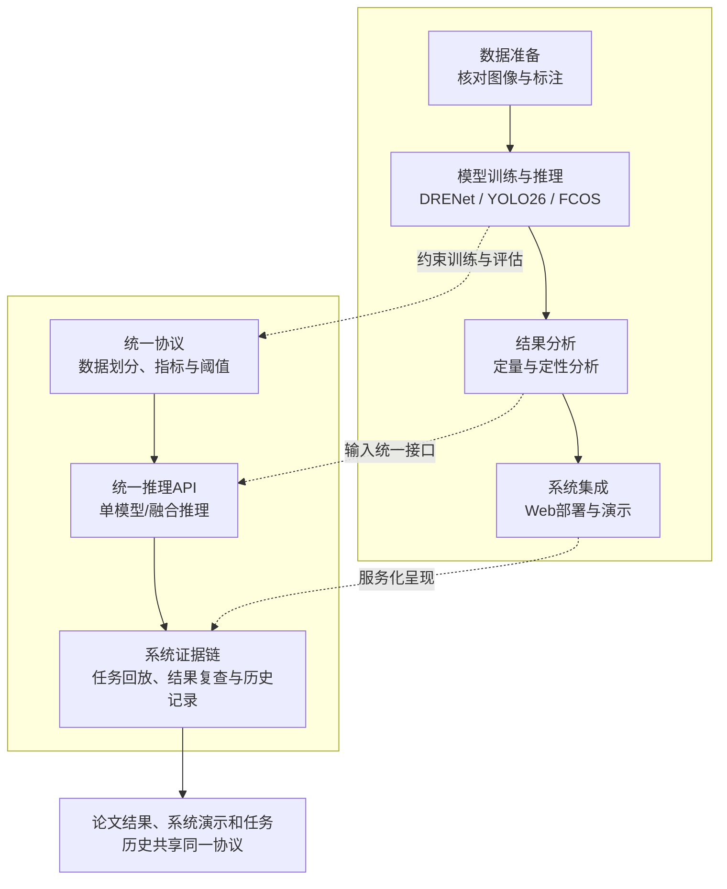
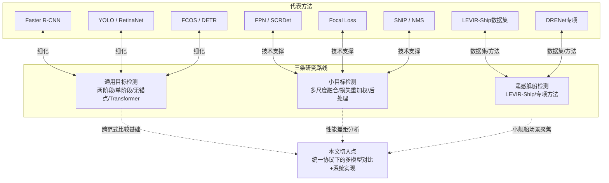
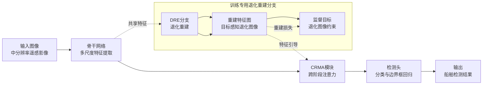
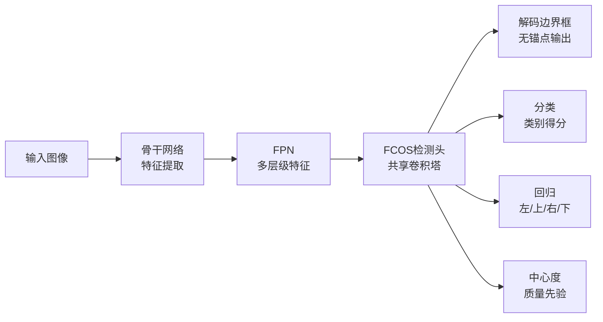
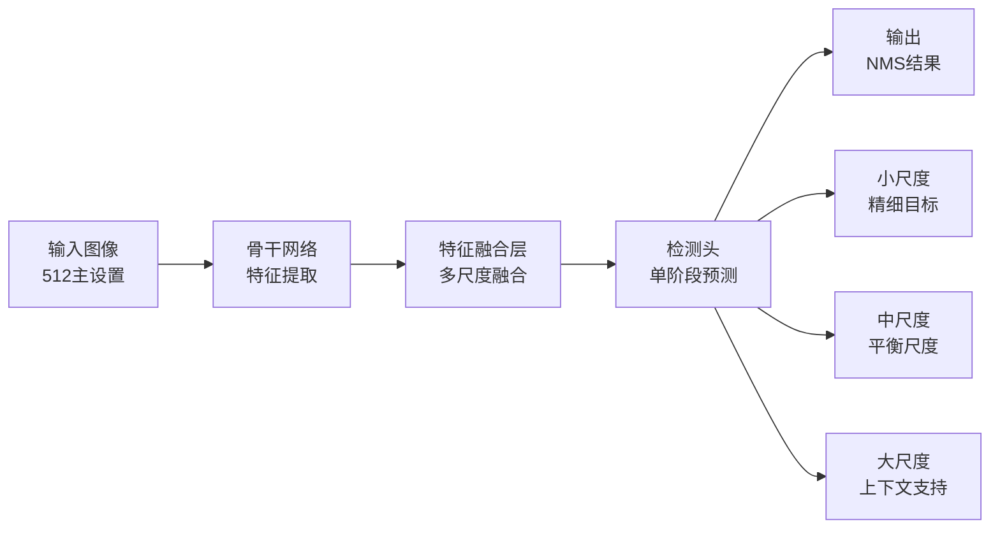
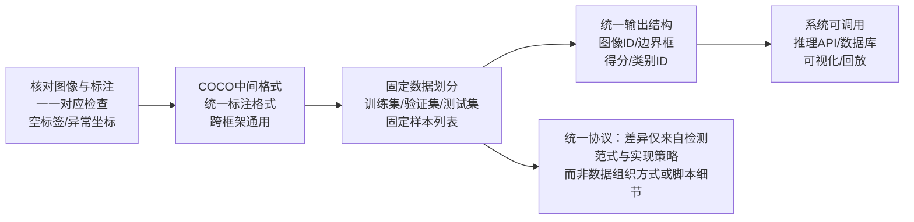
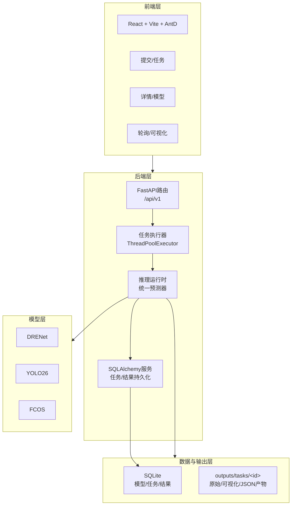
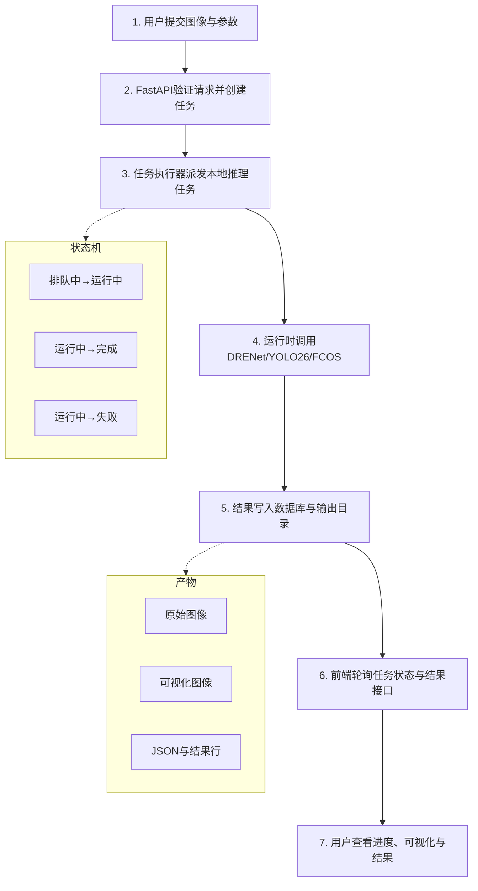
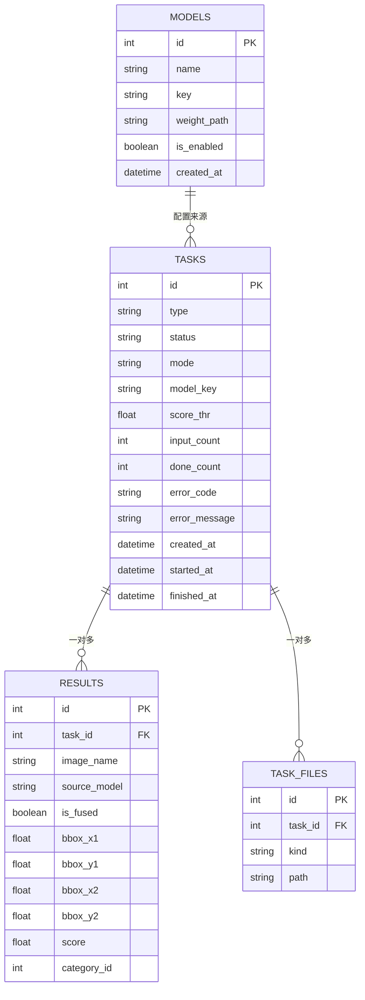

# 毕业论文插图生成指南

> 本文档将论文插图分为两类：
>
> - **Mermaid格式**：流程图、架构图、ER图等可用Mermaid代码直接生成
> - **图像生成Prompt**：包含遥感图像的定性分析图、复杂统计图表等，需使用gpt-image-2等模型生成

---

## 一、Mermaid格式图表（可直接代码转换）

### 1. ch1_pipeline - 第一章整体技术路线图



**风格参数：**

- 节点背景色: `#F7F7F7`
- 强调背景色: `#EFEFEF`
- 边框色: `#222222`
- 文字色: `#222222`
- 字体: Times New Roman / Songti SC

---

### 2. ch2_research_map - 第二章研究脉络图



---

### 3. ch3_drenet_overview - DRENet模型架构图



---

### 4. ch3_fcos_pipeline - FCOS检测流程图



---

### 5. ch3_yolo_pipeline - YOLO检测流程图



---

### 6. ch3_preprocess_flow - 数据预处理与统一格式流程



---

### 7. ch5_architecture - 系统整体架构图



---

### 8. ch5_flow - 系统业务流程图



---

### 9. ch5_er - 数据库ER关系图



---

## 二、图像生成Prompt（需使用gpt-image-2等模型）

以下图片包含遥感影像内容或复杂数据可视化，建议使用图像生成模型生成。

### 10. ch3_dataset_examples - 数据集样本展示

**Prompt:**

```
Create a 3x2 grid figure showing satellite remote sensing image samples from LEVIR-Ship dataset.
Each panel shows a 512x512 medium-resolution satellite image (GF-1 WFV sensor) with 1-3 small green bounding boxes marking ship targets.
Style: Academic thesis figure, clean white background, Times New Roman font style.
Top-left corner of each panel has a small label "GT: N" (N=1,2,3 indicating ground truth count).
Images show coastal/maritime scenes with varying water textures.
Color palette: Blue-green ocean water, gray-white ships, bright green (#50DC50) bounding boxes with 2px width.
Layout: 3 columns (horizontal), 2 rows (vertical), with 16px gap between panels.
Professional academic publication quality, high resolution.
```

---

### 11. ch4_main_comparison_chart - 主实验结果对比柱状图

**Prompt:**

```
Create a professional academic bar chart comparing three ship detection models (DRENet, YOLO26, FCOS) across 5 metrics: AP50, AP50-95, Precision, Recall, F1.
Layout: Grouped bar chart, 3 bars per metric group, 5 metric groups on X-axis.
Colors: DRENet in medium gray (#8C8C8C), YOLO26 in light gray (#B0B0B0), FCOS in lighter gray (#D0D0D0).
Y-axis range: 0 to 1.0, labeled "Score".
X-axis labels: "AP50", "AP50-95", "Precision", "Recall", "F1".
Each bar has value labels on top (3 decimal places), rotated 90 degrees.
Legend at top center, frameless, 3 columns.
Note at bottom right: "* FCOS recall uses AR@100 from formal run; Precision and F1 unavailable".
Style: Clean academic chart, white background, Times New Roman style fonts, no top/right borders.
Add light gray horizontal grid lines (-- style, alpha 0.25).
```

---

### 12. ch4_threshold_trend - 置信度阈值影响趋势图

**Prompt:**

```
Create a 1x3 subplot figure showing confidence threshold impact on detection performance for three models.
Each subplot is a line chart with X-axis: threshold values [0.15, 0.25, 0.35], Y-axis: Score [0.60, 0.88].
Three lines per subplot:
- Precision: steel blue (#566D7E) with circle markers
- Recall: sage green (#6E7F63) with circle markers
- F1: brown (#8A6A46) with circle markers
Each data point has value label annotation (3 decimals) with smart offset to avoid overlap.
Subplot titles: "DRENet", "FCOS", "YOLO26" (top center of each subplot).
Common legend at top center of figure (frameless, 3 columns).
Grid: Light gray dashed lines, alpha 0.25.
Style: Academic publication quality, white background, Times New Roman fonts, no top/right spines.
X-axis label (shared): "Confidence threshold", Y-axis label (shared): "Score".
```

---

### 13. ch4_size_trend - 输入尺寸影响趋势图

**Prompt:**

```
Create a 1x2 subplot figure showing inference image size impact on FCOS and YOLO26 performance.
Each subplot: Line chart with X-axis: image sizes [512, 640, 800], Y-axis: Score [0.40, 0.88].
Three lines per subplot:
- AP50: steel blue (#566D7E)
- Recall: sage green (#6E7F63)
- F1: brown (#8A6A46)
All lines have circle markers (size 6) and 2.3px width.
Each point has value label (3 decimals) with offset: Precision(-14,10), Recall(12,10), F1(0,-14).
Labels have white background boxes (alpha 0.95) to ensure readability.
Subplot titles: "FCOS", "YOLO26".
Common legend at top center (frameless, 3 columns).
X-axis ticks at [512, 640, 800], Y-axis shared between subplots.
Grid: Light gray dashed, alpha 0.25. No top/right spines.
Style: Academic quality, Times New Roman, white background.
```

---

### 14. ch4_efficiency_chart - 效率与复杂度对比图

**Prompt:**

```
Create a grouped bar chart comparing three models (DRENet, YOLO26, FCOS) on efficiency metrics.
X-axis: 3 metrics - "FPS", "Params(M)", "FLOPs(G)".
Y-axis: Score values (linear scale, auto-range).
3 bars per metric group:
- DRENet: medium gray (#8C8C8C)
- YOLO26: light gray (#B0B0B0)
- FCOS: lighter gray (#D0D0D0)
Each bar has value label on top: "121.90", "4.79", "4.21" format (2 decimals for <10, 1 for >=10).
Legend: Top center, frameless, 3 columns.
Y-axis label: "Score" (or appropriate units).
Grid: Light gray horizontal dashed lines, alpha 0.25.
No top/right spines. Clean academic style, Times New Roman, white background.
```

---

### 15. ch4_radar_chart - 多维度雷达图

**Prompt:**

```
Create a polar/radar chart comparing three ship detection models across 8 dimensions.
Dimensions (clockwise from top): AP50, AP50-95, Precision, Recall, F1, FPS norm, Params eff, FLOPs eff.
Three polygons:
- DRENet: medium gray (#8C8C8C), line width 2.0, fill alpha 0.15
- YOLO26: light gray (#B0B0B0), line width 2.0, fill alpha 0.15
- FCOS: lighter gray (#D0D0D0), line width 2.0, fill alpha 0.15
Radial axis: 0 to 1.0, ticks at 0.2, 0.4, 0.6, 0.8, 1.0.
Axis labels: Gray (#555555), size 8.
Dimension labels on perimeter: Size 10.
Legend: Upper right, frameless, outside main plot area.
Style: Academic quality, white/light gray background, clean circular grid.
```

---

### 16. ch4_success_cases - 检测成功案例定性分析

**Prompt:**

```
Create a qualitative analysis figure showing successful ship detection results.
Layout: 3 columns (models: DRENet, YOLO26, FCOS) × 2 rows (Label row, Prediction row).
Each panel: 520×520 satellite image tile from LEVIR-Ship dataset.
Row 1 (Label): Original image with GREEN bounding boxes showing ground truth ships.
Row 2 (Prediction): Same image with colored detection boxes:
- DRENet column: Red boxes (#FF5A5A)
- YOLO26 column: Blue boxes (#46AAFF)
- FCOS column: Yellow boxes (#FFC846)
Column headers: Model names centered above top row.
Row labels on left: "Label", "Prediction" vertically centered.
Style: Academic figure, white background, clean layout with 20px gaps.
Images show successful detection cases with minimal false positives/negatives.
Satellite imagery: GF-1 WFV sensor, coastal scenes, blue-green water.
```

---

### 17. ch4_miss_cases - 漏检案例定性分析

**Prompt:**

```
Create a qualitative analysis figure showing ship detection miss cases (false negatives).
Layout: Same 3×2 grid as success cases (3 model columns, Label/Prediction rows).
Each panel: 520×520 satellite image.
Label row: Green boxes showing ALL ground truth ships that SHOULD be detected.
Prediction row: Model-specific colored boxes showing detected ships, with CLEARLY VISIBLE missing targets (undetected ships still visible in image but without boxes).
Column headers: "DRENet", "YOLO26", "FCOS".
Row labels: "Label", "Prediction".
Purpose: Highlight cases where models fail to detect small or ambiguous ships.
Style: Academic figure, clean layout, Times New Roman style text.
Select challenging cases: small ships, low contrast, clustered targets.
```

---

### 18. ch4_false_positive_cases - 误检案例定性分析

**Prompt:**

```
Create a qualitative analysis figure showing false positive ship detection cases.
Layout: 3×2 grid (3 models, Label/Prediction rows), 520×520 panels.
Label row: Green boxes showing actual ships (usually 0-2 targets).
Prediction row: Colored boxes showing model predictions with EXTRA boxes marking false detections (background objects incorrectly classified as ships).
Colors:
- Ground truth: Bright green (#50DC50)
- DRENet predictions: Red (#FF5A5A)
- YOLO26 predictions: Blue (#46AAFF)
- FCOS predictions: Yellow (#FFC846)
Show cases where models detect non-ship objects (waves, clouds, coastlines, artifacts) as ships.
Purpose: Compare false positive patterns across three detection paradigms.
Style: Academic publication quality, clean white background.
```

---

### 19. ch5_pages - 系统界面多页展示

**Prompt:**

```
Create a multi-page screenshot composite showing a web-based ship detection system interface.
Layout: 2×2 or 3×2 grid showing different system pages:
1. Task submission page: Upload area, model selection dropdown, threshold slider
2. Task list page: Table with status (queued/running/done), progress indicators
3. Task detail page: Image grid, detection results overlay, download buttons
4. Visualization page: Side-by-side original/detected comparison, zoom controls
Style: Modern web UI, React + Ant Design aesthetic.
Color scheme: Clean whites, light grays (#F5F5F5), accent blue (#1890FF) for primary actions.
Typography: System fonts, 14px body, 16px headers.
Include realistic content: satellite thumbnails, bounding box overlays, confidence scores.
Academic figure quality with subtle drop shadows and rounded corners (4px radius).
```

---

## 三、图表分类汇总表

| 图号 | 文件名                    | 类型         | 生成方式  | 复杂度 | 状态   |
| ---- | ------------------------- | ------------ | --------- | ------ | ------ |
| 1    | ch1_pipeline              | 技术路线图   | Mermaid   | 中     | 已完成 |
| 2    | ch2_research_map          | 研究脉络图   | Mermaid   | 中     | 已完成 |
| 3    | ch3_drenet_overview       | 模型架构图   | Mermaid   | 高     | 已完成 |
| 4    | ch3_fcos_pipeline         | 检测流程图   | Mermaid   | 中     | 已完成 |
| 5    | ch3_yolo_pipeline         | 检测流程图   | Mermaid   | 中     | 已完成 |
| 6    | ch3_preprocess_flow       | 数据处理流程 | Mermaid   | 中     | 已完成 |
| 7    | ch5_architecture          | 系统架构图   | Mermaid   | 高     | 已完成 |
| 8    | ch5_flow                  | 业务流程图   | Mermaid   | 中     | 已完成 |
| 9    | ch5_er                    | ER关系图     | Mermaid   | 低     | 已完成 |
| 10   | ch3_dataset_examples      | 数据集样本   | Image Gen | 中     | 已完成 |
| 11   | ch4_main_comparison_chart | 对比柱状图   | Image Gen | 中     | 已完成 |
| 12   | ch4_threshold_trend       | 趋势折线图   | Image Gen | 高     | 已完成 |
| 13   | ch4_size_trend            | 趋势折线图   | Image Gen | 中     | 已完成 |
| 14   | ch4_efficiency_chart      | 效率对比图   | Image Gen | 低     | 已完成 |
| 15   | ch4_radar_chart           | 雷达图       | Image Gen | 中     | 已完成 |
| 16   | ch4_success_cases         | 定性分析图   | Image Gen | 高     | 已完成 |
| 17   | ch4_miss_cases            | 定性分析图   | Image Gen | 高     | 已完成 |
| 18   | ch4_false_positive_cases  | 定性分析图   | Image Gen | 高     | 已完成 |
| 19   | ch5_pages                 | 界面截图     | Image Gen | 中     | 已完成 |

---

## 四、使用说明

### Mermaid图表生成

1. 将上述Mermaid代码复制到 [Mermaid Live Editor](https://mermaid.live) 或支持Mermaid的Markdown渲染器
2. 导出为PNG/SVG格式
3. 使用统一的配色方案确保风格一致

### 图像生成模型使用

1. 将Prompt复制到gpt-image-2或其他图像生成模型
2. 建议参数：
   - 分辨率：根据原图尺寸（通常 1200×800 或更高）
   - 风格：Academic/Professional
   - 背景：纯白 (#FFFFFF)
3. 如有需要，可先生成草图再迭代优化

### 输出规范

| 场景         | 推荐格式 | 分辨率      | 备注             |
| ------------ | -------- | ----------- | ---------------- |
| LaTeX (矢量) | SVG/PDF  | 矢量        | 最佳质量，文件小 |
| LaTeX (位图) | PNG      | 300+ DPI    | 需确保高清源文件 |
| Word/PPT     | PNG/EMF  | 150-300 DPI | 兼容性优先       |
| 网页展示     | SVG/PNG  | 72-150 DPI  | 压缩后使用       |

### Mermaid图表生成

1. 将上述Mermaid代码复制到 [Mermaid Live Editor](https://mermaid.live) 或支持Mermaid的Markdown渲染器
2. 导出为PNG/SVG格式
3. 使用统一的配色方案确保风格一致

### 风格统一要求

- **配色**：
  - 主灰色系: #8C8C8C (深), #B0B0B0 (中), #D0D0D0 (浅)
  - 强调色: #566D7E (蓝灰), #6E7F63 (绿灰), #8A6A46 (棕)
  - 背景: #FFFFFF, 次要背景: #F7F7F7
- **箭头**：1.2px，深灰 (#222222)，箭头大小 8-10px
- **字体**：Times New Roman, Songti SC (中文), 10-12pt
- **边框**：1.2px 深灰 (#222222)，圆角 2-4px
- **输出格式**：
  - 矢量图优先：SVG/PDF（无限缩放不失真）
  - 位图备用：PNG，300 DPI 以上
- **分辨率要求**：印刷级 300-600 DPI，屏幕展示 150 DPI 即可
